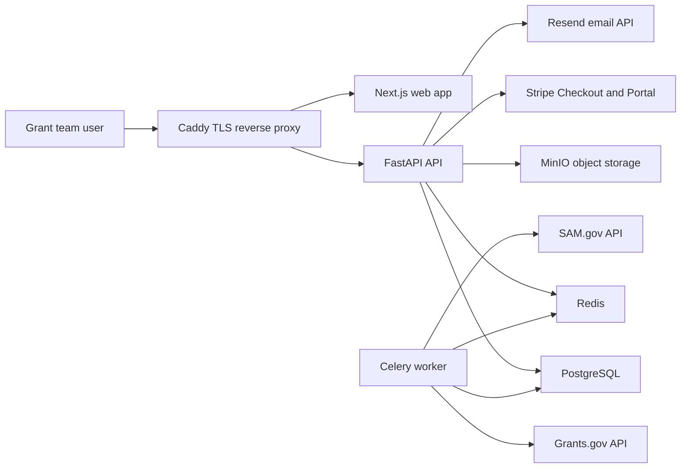

# GrantAtlas Architecture

## Product Boundary

GrantAtlas is a multi-tenant SaaS for funding discovery, fit scoring, pipeline tracking, proposal preparation, billing, and operator administration.

The MVP focuses on nonprofit and research grant workflows:

- Multi-tenant auth and organization profile
- Manual opportunities and Grants.gov ingestion
- Transparent rule-based matching
- Pipeline dashboard and opportunity detail analysis
- Proposal workspaces
- Reusable proposal library
- Stripe Billing with a 14-day trial
- Resend transactional notifications
- Super-admin tenant and usage views

The v2 scaffold adds SAM.gov contract opportunities, capture management, NAICS/PSC matching, partner tracking, and past-performance assets while keeping the grant pipeline separate.

## Runtime Topology

## Tenancy Model

Every tenant-owned table has a `tenant_id` foreign key. API queries must filter by `current_user.tenant_id` unless the route requires super-admin access. Admin support impersonation is a future extension and must write an audit record before access.

Primary tenant tables:

- `tenants`
- `users`
- `organization_profiles`
- `opportunities`
- `opportunity_scores`
- `proposal_workspaces`
- `library_items`
- `contract_opportunities`
- `contract_scores`
- `capture_plans`
- `past_performance_projects`
- `teaming_partners`
- `audit_logs`

## Data Flow

1. Users authenticate with email/password and receive a signed access token.
2. The API resolves the user and tenant from the token for each request.
3. Manual opportunities are saved directly under the tenant.
4. Grants.gov ingestion normalizes external records into the internal opportunity schema.
5. The scoring service compares the tenant profile against opportunity metadata and stores a transparent score.
6. Proposal workspaces attach to selected opportunities.
7. Stripe webhooks update tenant plan, status, trial end, and usage limits.
8. Resend sends notifications for invitations, deadlines, trials, and task events.

## Database Schema

The initial migration lives at `apps/api/alembic/versions/0001_initial.py`.

Key entities:

- `Tenant`: billing identity, subscription plan/status, trial end, usage limits
- `User`: login identity, tenant role, optional super-admin flag
- `OrganizationProfile`: mission, focus areas, registrations, programs, target populations, past performance
- `Opportunity`: normalized federal, foundation, corporate, or manual funding record
- `OpportunityScore`: transparent matching dimensions and recommended action
- `ProposalWorkspace`: outline, compliance matrix, attachments, tasks, budget, narratives, comments, versions
- `LibraryItem`: reusable proposal content
- `ContractOpportunity`: SAM.gov/manual contract opportunity record
- `ContractScore`: v2 capture fit score with NAICS, PSC, past performance, set-aside, deadline, and strategic value dimensions
- `CapturePlan`: bid decision, win themes, compliance matrix, color team reviews, and capture tasks
- `PastPerformanceProject`: reusable contract/project history for capture scoring and proposals
- `TeamingPartner`: partner capability, NAICS, and set-aside profile
- `AuditLog`: sensitive action trace

## API Route Map

- `GET /health`
- `POST /auth/login`
- `GET /auth/me`
- `GET /organization/profile`
- `PUT /organization/profile`
- `GET /opportunities`
- `POST /opportunities`
- `GET /opportunities/{id}`
- `POST /opportunities/ingest/grants-gov`
- `GET /contracts`
- `POST /contracts`
- `GET /contracts/{id}`
- `POST /contracts/ingest/sam-gov`
- `POST /contracts/{id}/capture-plan`
- `GET /proposals`
- `POST /proposals`
- `GET /proposals/{id}`
- `GET /library`
- `POST /library`
- `PUT /library/{id}`
- `GET /partners`
- `POST /partners`
- `PUT /partners/{id}`
- `GET /past-performance`
- `POST /past-performance`
- `PUT /past-performance/{id}`
- `POST /billing/checkout`
- `POST /billing/portal`
- `GET /admin/tenants`
- `GET /admin/usage`

## Frontend Page Map

- `/login`: email/password entry
- `/dashboard`: pipeline metrics, filters, opportunity table
- `/opportunities/[id]`: summary, score, eligibility, timeline, checklist, strategy
- `/contracts`: SAM.gov/manual contract pipeline
- `/contracts/[id]`: fit score, capture snapshot, win themes, compliance matrix, color team reviews
- `/proposals/[id]`: proposal outline, compliance matrix, task board
- `/library`: reusable narrative content
- `/past-performance`: contract and project proof points
- `/partners`: teaming partner database
- `/organization`: tenant profile
- `/admin`: platform operator dashboard

## Source Notes

- Grants.gov documents System-to-System web services for applicant and agency integrations at `https://www.grants.gov/system-to-system.html`.
- SAM.gov Contract Opportunities Public API v2 is planned for v2 at `https://sam.gov/data-services/Contract%20Opportunities/Public%20V2?privacy=Public`.
- Stripe Checkout free trials use subscription trial settings; current docs are at `https://docs.stripe.com/payments/checkout/free-trials`.
